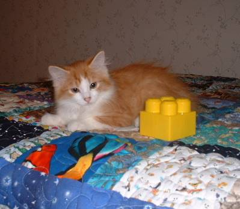
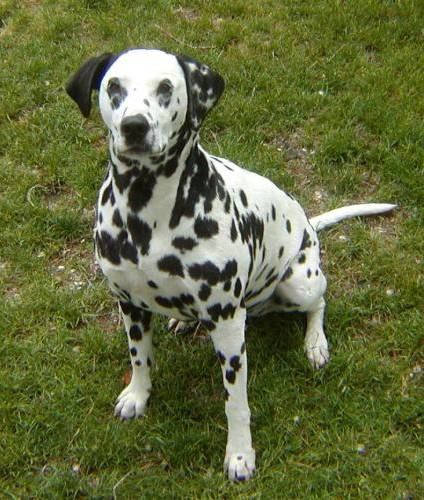

# Building a Simple TensorFlow Binary Classifier from Scratch

Project file: tf_binary_classifier_from_scratch.ipynb

Dataset: https://storage.googleapis.com/tensorflow-1-public/course2/cats_and_dogs_filtered.zip

Given a dataset containing images of cats & dogs, we create a simple CNN which can predict the class of a new unseen image. We use this problem to compare the effects of augmenting or not augmenting the images by looking at the corresponding loss/accuracy plots.

Example images from dataset:

Note: different sized images

This is a basic CNN. More complicated deep learning models utilising dropouts, callbacks & different model structures can be found in the other CV, TS & NLP projects.