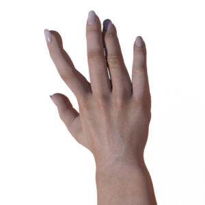
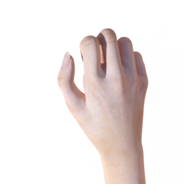
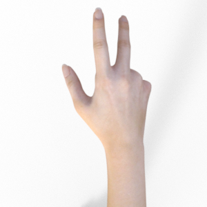

# Building a CNN for Hand Pose Estimation (Multi-Classification) Using Dropout to Prevent Overfitting

Project file: tf_multi_classifier_from_scratch.ipynb

Given an artificially generated dataset containing images of hand poses in rock, paper & scissors positions, we build a CNN to classify the hand pose of an unseen image. At the end of the notebook we then show that the model (trained on artifically generated images) can be used to classify real images of hand poses.

Example images:

Dataset: https://www.tensorflow.org/datasets/catalog/rock_paper_scissors

