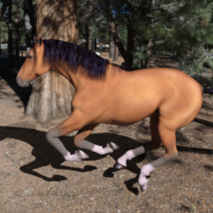

# Building a Deep Learning Binary Classifier Using Transfer Learning

Project file: tf_transfer_learning_binary_classifier.ipynb

Given an artificially generated dataset containing images of horses and humans, we create a CNN based off the Inception architecture to predict the class of a new unseen image.

Example images from dataset:

Train dataset: https://storage.googleapis.com/tensorflow-1-public/course2/week3/horse-or-human.zip
Validation dataset: https://storage.googleapis.com/tensorflow-1-public/course2/week3/validation-horse-or-human.zip

Model weights: https://storage.googleapis.com/mledu-datasets/inception_v3_weights_tf_dim_ordering_tf_kernels_notop.h5