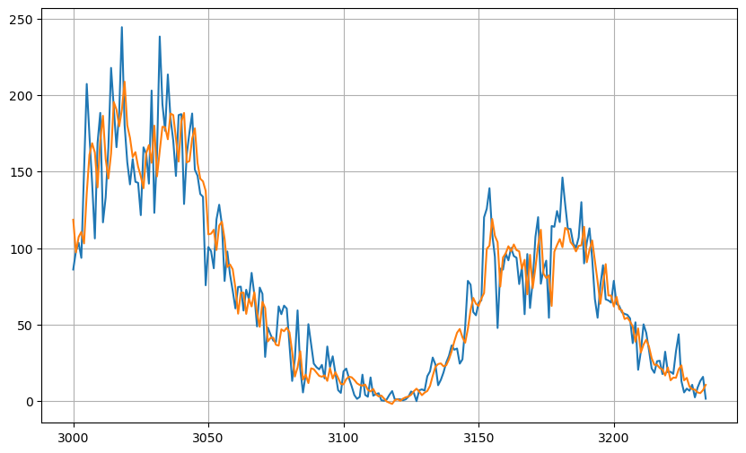

# Time Series Projects

- Recurrent Neural Network to forecast future time series values based on windowed data input. Built in TensorFlow - using convolution, LSTM & fully connected layers. Project based on predicting sunspots.

Project file: RNN_forecasting.ipynb